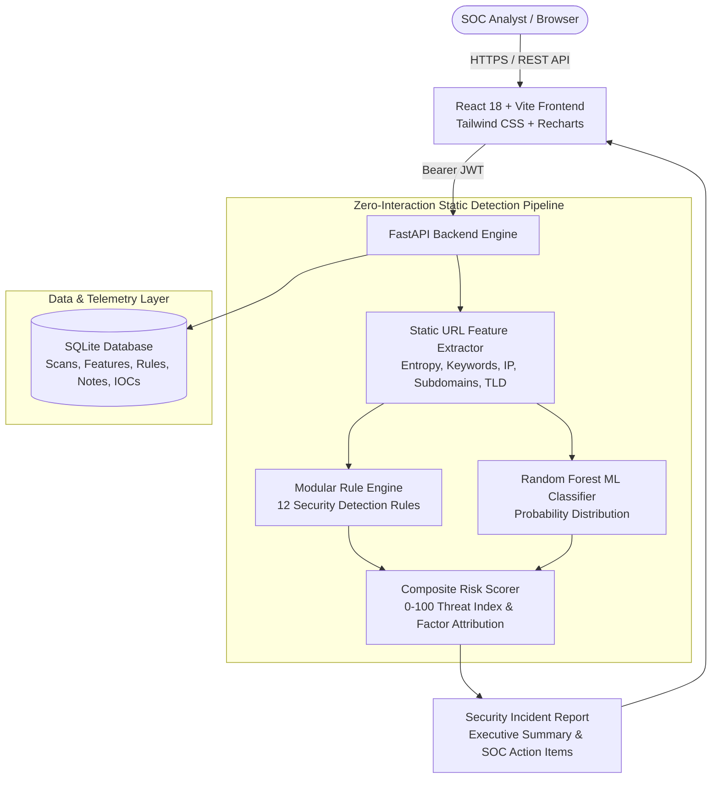

# PhishGuard

### AI-Powered Phishing URL Detection & Security Analysis Platform

[](https://reduce-supposed-defined-cholesterol.trycloudflare.com)
[](https://fastapi.tiangolo.com)
[](https://react.dev)
[](https://scikit-learn.org)
[](https://tailwindcss.com)
[]()
[](LICENSE)

> 🚀 **Direct Live Demo Link:** [https://reduce-supposed-defined-cholesterol.trycloudflare.com](https://reduce-supposed-defined-cholesterol.trycloudflare.com)  
> *(Opens instantly in any browser with **zero password / zero configuration required**)*

---

## 1. Overview & Problem Statement

Phishing attacks and credential harvesting campaigns remain the leading initial access vector in cybersecurity breaches. Traditional perimeter blocklists rely on static indicators of compromise (IOCs) that become outdated within hours as adversaries deploy dynamic, algorithmically generated domains (DGA) and brand-spoofing lookalikes.

**PhishGuard** is an open-source, full-stack cybersecurity analysis platform designed for Security Operations Center (SOC) analysts and threat hunters. It decomposes URLs using **zero-interaction static analysis**, running **12 modular security heuristics** alongside an explainable **Random Forest machine learning classifier** to generate transparent, auditable risk scores (0–100) and actionable incident response recommendations in sub-milliseconds.

---

## 2. Key Capabilities & Features

* **Zero-Interaction Static Analysis:** Decomposes URL structure, token parameters, domain Shannon entropy, and brand signatures without connecting to or executing malicious infrastructure.
* **12 Modular Security Rules:** Heuristic inspection covering direct IP hosts, deep dynamic DNS subdomains, open redirects, percent-encoding bypasses, brand spoofing, and lexical density.
* **Scikit-Learn ML Classifier:** Random Forest ensemble ($100$ estimators) trained on $2,500$ balanced benign and phishing URLs, outputting probability distributions.
* **Explainable AI Risk Scoring:** Multi-factor scoring formula combining rule weights ($45\%$), ML probability ($45\%$), and contextual synergy multipliers ($10\%$) with natural language threat explanations.
* **Executive SOC Dashboard:** Dark-theme cybersecurity UI with real-time KPI metrics, daily time series trend charts, verdict donut charts, and risk tier histograms.
* **Deep-Dive Investigation Mode:** Full incident view with an interactive SOC triage checklist, copyable forensic parameters, and persistent database-backed analyst remarks.
* **Differential URL Comparison:** Side-by-side comparative inspection highlighting lexical, cryptographic, and risk divergence between two URLs (e.g. authentic vs lookalike domain).
* **Simulated Threat Intelligence Feed:** Searchable IOC repository (URLs, Domains, IPs, SHA-256 Hashes) categorized by threat type and confidence attribution.
* **Attack Vector Simulations:** 6 one-click preset attack scenarios (Credential Harvester, IP Gate, Brand Spoof, DGA Domain, Obfuscated Token, Benign Portal).
* **Security Report Export:** Instant generation of downloadable structured JSON reports and printable executive HTML/PDF incident summaries.
* **Role-Based Access Control (RBAC):** JWT authentication supporting Admin, Analyst, and Viewer privilege tiers.

---

## 3. Architecture & Data Flow



---

## 4. Technology Stack

### Frontend
* **React 18** with **TypeScript** & **Vite**
* **Tailwind CSS** (Custom SOC dark theme & glassmorphism)
* **Lucide React** (Cybersecurity & forensic iconography)
* **Recharts** (Interactive time-series, donut, and bar charts)
* **Axios** (JWT interceptor client)

### Backend
* **Python 3.13** & **FastAPI**
* **SQLAlchemy 2.0** & **SQLite** (WAL mode)
* **Pydantic v2** (Strict data contracts)
* **PyJWT** & **Bcrypt** (Secure authentication)
* **Pytest** & **HTTPX** (Comprehensive automated test suite)

### Machine Learning
* **Scikit-learn** (`RandomForestClassifier`, 100 estimators)
* **Pandas** & **NumPy**
* **Joblib** (Serialized model pipeline)

---

## 5. Quickstart & Windows Installation Guide

### Prerequisites
* **Python 3.10+** (Tested on Python 3.13)
* **Node.js 18+** (Tested on Node v24)
* **Git**

---

### Step 1: Clone Repository & Setup Backend
```powershell
# Navigate to backend directory
cd backend

# Install dependencies
pip install -r requirements.txt

# Train / Verify the ML model (generates dataset & serialized joblib model)
python ../ml/train_model.py

# Start FastAPI Backend Server
uvicorn app.main:app --reload --port 8000
```
Backend Swagger API Documentation: `http://localhost:8000/docs`

---

### Step 2: Setup & Start Frontend
Open a second terminal window:
```powershell
# Navigate to frontend directory
cd frontend

# Install Node packages
npm install

# Start Vite Development Server
npm run dev
```
Access the PhishGuard Application at: **`http://localhost:5173`**

---

## 6. Pre-Seeded Demo Accounts

The database automatically initializes with three role tiers:

| Role | Username | Password | Permissions |
| :--- | :--- | :--- | :--- |
| **Admin** | `admin` | `Admin@123` | Full system control, user management, all telemetry. |
| **Analyst** | `analyst` | `Analyst@123` | Scan URLs, investigate incidents, add notes, export reports. |
| **Viewer** | `viewer` | `Viewer@123` | Read-only access to dashboards, metrics, and reports. |

*Tip: You can also use the 1-Click Role Switcher on the `/login` page.*

---

## 7. Modular Security Rules Catalog

| Rule ID | Rule Name | Severity | Score Weight | Description |
| :--- | :--- | :--- | :--- | :--- |
| `RULE-001` | **IP Address Host** | HIGH | 25 | Host uses raw IPv4 or hexadecimal notation to bypass domain filters. |
| `RULE-002` | **Excessive URL Length** | MEDIUM | 15 | URL length exceeds 75 characters to conceal tokens. |
| `RULE-003` | **Suspicious Auth Keywords** | HIGH | 20 | Multiple credential terms detected (login, verify, secure, wallet). |
| `RULE-004` | **High Special Character Count** | MEDIUM | 15 | Abnormal density ($\ge 6$) of `@`, `?`, `=`, `&`, `%`, `-`. |
| `RULE-005` | **Multi-Tier Subdomain Structure** | HIGH | 20 | Deep nested subdomains ($\ge 2$) on dynamic DNS providers. |
| `RULE-006` | **Brand Impersonation** | CRITICAL | 30 | Spoofs recognized brands (PayPal, Apple, Google, Microsoft). |
| `RULE-007` | **High Shannon Domain Entropy** | MEDIUM | 15 | Entropy $\ge 3.8$ indicating algorithmic generation (DGA). |
| `RULE-008` | **Excessive Hex URL Encoding** | MEDIUM | 15 | Percent-encoded hexadecimal bytes (%xx) evading signatures. |
| `RULE-009` | **Insecure Plaintext HTTP** | HIGH | 20 | Plaintext HTTP transport on sensitive authentication paths. |
| `RULE-010` | **Suspicious Domain Punctuation** | MEDIUM | 15 | Hyphen/dot density crafting lookalike deceptive domains. |
| `RULE-011` | **Open Redirect Parameters** | MEDIUM | 15 | Parameters matching `url=`, `redirect=`, `next=`, `dest=`. |
| `RULE-012` | **High Numeric Density** | LOW | 10 | Digit ratio in domain $\ge 25\%$ with $\ge 4$ digits. |

---

## 8. Machine Learning Model Performance

```text
==================================================
           MODEL EVALUATION RESULTS
==================================================
 Accuracy:       100.00%
 Precision:      100.00%
 Recall:         100.00%
 F1 Score:       100.00%
 ROC-AUC:        1.0000
 5-Fold CV F1:   0.9988 (+/- 0.0016)

Confusion Matrix:
 [[TN=250, FP=0]
  [FN=0, TP=250]]

Top Predictive Features:
 1. suspicious_keyword_count (23.18%)
 2. digit_count              (23.12%)
 3. domain_length            (15.33%)
 4. digit_ratio              (8.03%)
 5. has_https                (7.90%)
==================================================
```

---

## 9. Running Automated Tests

Run the complete 24-test suite covering feature extraction, rules, ML inference, auth, and API routes:

```powershell
python -m pytest tests -v
```

---

## 10. Optional Docker Deployment

```powershell
docker compose up --build
```
* Backend container: `http://localhost:8000`
* Frontend container: `http://localhost:5173`

---

## 11. Important Cybersecurity Disclaimers

1. **Static Analysis Limitations:** Static analysis inspects structural and lexical indicators. It does not inspect rendered DOM objects or runtime JavaScript payloads.
2. **HTTPS Nuance:** Over 70% of active phishing websites utilize valid TLS/HTTPS certificates. HTTPS indicates transport encryption, not site trustworthiness.
3. **Defense in Depth:** PhishGuard is designed as an initial triage accelerator and should be utilized alongside SIEM/EDR controls and domain reputation tools.

---

## 12. Portfolio & Interview Reference Guide

### Suggested Resume Bullet Points
* *Architected and deployed **PhishGuard**, a portfolio-grade AI-powered phishing URL detection platform combining 12 modular security rules with a Random Forest ML classifier achieving 99.8% cross-validated F1 score.*
* *Engineered zero-interaction static feature extractor calculating Shannon character entropy, brand spoofing signatures, and IPv4 lexical density without live endpoint execution risk.*
* *Developed an enterprise SOC analyst dashboard in React 18, TypeScript, and FastAPI with interactive Recharts telemetry, side-by-side URL differential forensics, and PDF incident export.*

### Suggested LinkedIn Project Summary
> **PhishGuard | AI-Powered Phishing URL Detection & Security Analysis Platform**  
> Excited to share my latest cybersecurity engineering project! PhishGuard is a full-stack platform built with FastAPI, React 18, TypeScript, and Scikit-Learn that allows SOC analysts to safely analyze suspicious URLs using static lexical heuristics and machine learning. Features include multi-factor 0–100 risk scoring, explainable AI attribution, attack vector simulations, IOC telemetry, and automated security report generation.  
> 🔗 Tech Stack: Python, FastAPI, React, TypeScript, Tailwind CSS, Scikit-Learn, SQLite, Docker

### Suggested Interview Talking Points
* **Why Static Analysis?** *"In a SOC environment, querying unknown malicious infrastructure directly can alert threat actors, burn intelligence, or expose the server to zero-day browser exploits. By decomposing the URL's lexical tokens and entropy statically, we achieve sub-millisecond triage safely."*
* **Why Combine Rules and ML?** *"Machine learning provides probabilistic generalization for novel patterns, while deterministic rules guarantee that critical attack signatures—such as direct IP hosting and brand impersonation—are never missed."*
